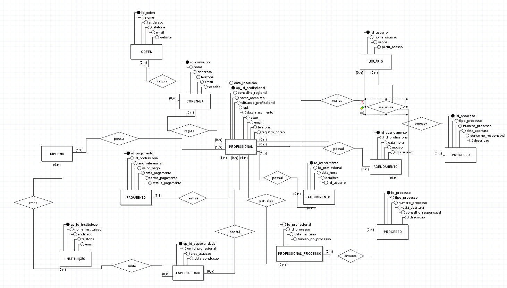
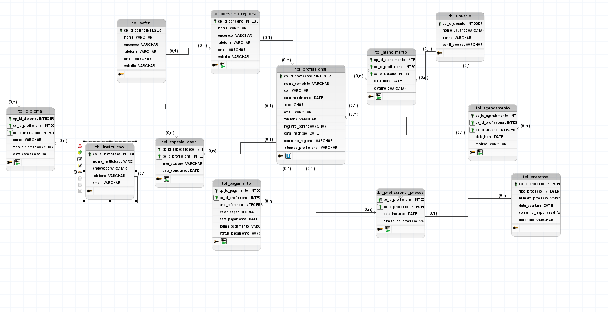
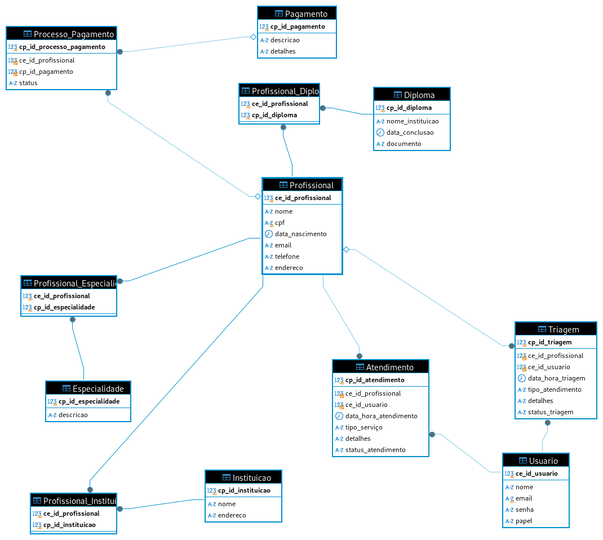

# Projeto - Elaboração, Implantação, Governança e Uso de Banco de Dados em Estudo de Caso

## MATA60 - Banco de Dados
Prof. Robespierre Pita
## 1. Modelando a Base de Dados

### 1.1 PROBLEMA

O COREN-BA, Conselho Regional de Enfermagem da Bahia, é uma autarquia federal essencial para o funcionamento da enfermagem na Bahia. Ele tem o papel de garantir a qualidade e segurança dos serviços prestados, sendo responsável por regulamentar e fiscalizar a prática da enfermagem, certificando que todos os profissionais de enfermagem, ou seja, enfermeiros, técnicos e auxiliares, sigam padrões éticos, legais e técnicos ao exercerem suas funções.

Para exercer seus cargos, os profissionais precisam estar com o seu **"COREN ATIVO"**, o que significa comprovar o diploma de formação, especialidades e também o pagamento da anuidade em dia.

O COREN-BA enfrenta alguns desafios na sua gestão, especialmente no atendimento aos profissionais. Os atendentes que dão suporte precisam otimizar seu trabalho, pois existe alta demanda na gestão dos profissionais de enfermagem. O processo de cadastro gera muito retrabalho, com informações que já poderiam constar no sistema precisando ser preenchidas sempre que um atendimento ao profissional é realizado (inclusão/exclusão). No processo de pagamento da anuidade, por exemplo, os cálculos de multas, parcelas e descontos precisam ser feitos toda vez que há atendimento ao profissional da enfermagem.

Além dos dados profissionais e de ensino, existem processos administrativos, entre outros, para controle e fiscalização. Para os atendimentos, utilizam-se pelo menos três sistemas terceirizados para realizar os procedimentos de gestão do profissional. Além dessa falta de otimização de tempo e trabalho, os programas (sistemas) utilizados já estão defasados, e outros não realizam atualizações periódicas, o que consequentemente prejudica o atendimento. Ferramentas necessárias, como o pagamento via PIX, não foram implantadas, pois não conseguiram corrigir os bugs. O API do Banco do Brasil não funciona corretamente.

Há programas que precisam ter integração com o COFEN - Conselho Federal de Enfermagem. Todos os dados dos profissionais precisam ser repassados para o COFEN, então centralizar essas informações otimizaria a gestão de dados. Acredito que um sistema único, escalável, com integração com o COFEN-BA e as instituições de ensino seja a melhor opção para otimizar o atendimento dos profissionais de enfermagem.
## 1.2 REQUISITOS DO SISTEMA DE INFORMAÇÃO

O sistema tem como objetivo fazer a gestão das informações dos profissionais cadastrados, assim como ser capaz de incluir novos profissionais. Deve também obter informações das instituições de ensino vinculadas aos profissionais para comprovar a veracidade dos diplomas apresentados. Além disso, o sistema deve fazer a gestão do pagamento da anuidade da carteira profissional de enfermagem, verificando parcelas pendentes, renovação, quitação, e também a verificação de processos que o profissional pode estar envolvido.

### Requisitos Funcionais (RF)

**RF1: Cadastro de Profissionais**  
O sistema deve permitir o cadastro de enfermeiros, técnicos e auxiliares de enfermagem com informações como:
- Dados pessoais (nome completo, CPF, data de nascimento, sexo, email, telefone, foto).
- Formação profissional (instituição de ensino, diploma, curso, tipo de diploma, data de concessão).
- Registro no COREN (número do COREN, data de inscrição, conselho regional).
- Situação profissional (ativo, suspenso, inativo, cancelado).
- Especialidades (áreas de atuação, data de conclusão).
- Histórico de pagamentos de anuidade (ano de referência, valor pago, data de pagamento, forma de pagamento, status do pagamento).

**RF2: Verificação e Atualização do Status do COREN**  
O sistema deve permitir a verificação do status do COREN dos profissionais e possibilitar a atualização do status conforme a comprovação de diploma, especialidades e pagamento da anuidade.

**RF3: Controle de Pagamento de Anuidades**  
O sistema deve gerenciar o pagamento de anuidades, calcular automaticamente multas, parcelas e descontos, e registrar os pagamentos feitos:
- Valor base da anuidade.
- Multas por atraso no pagamento.
- Descontos por pagamento em dia ou antecipado.
- Parcelamento da anuidade em até X parcelas (definível pelo sistema).
- Integração com gateways de pagamento para recebimento online.
- Registro automático dos pagamentos realizados.
- Confirmação da efetivação dos pagamentos realizados.
- Atualização automática do status dos pagamentos no sistema.
- Identificação e solução de divergências entre os dados do sistema e os extratos bancários.
- Emissão de comprovantes de pagamento da anuidade.
- O sistema deve suportar pagamentos via PIX, garantindo uma opção de pagamento rápida e eficiente.

**RF4: Histórico de Atendimento**  
O sistema deve manter um histórico de todos os atendimentos realizados para cada profissional, incluindo detalhes de cada interação e as informações fornecidas ou atualizadas.

**RF5: Integração com o COFEN**  
O sistema deve ser capaz de integrar-se com o COFEN para enviar e receber informações dos profissionais de enfermagem em tempo real:
- Sincronização de dados de profissionais em tempo real.
- Recebimento de notificações sobre alterações no status dos profissionais no COFEN-BA.
- Envio de informações sobre os profissionais do COREN-BA para o COFEN-BA, conforme exigências.

**RF6: Integração com Instituições de Ensino**  
O sistema deve integrar-se com instituições de ensino para verificar e validar automaticamente diplomas e certificados de especialização dos profissionais.

**RF7: Gerenciamento de Processos**  
O sistema deve ser capaz de gerar relatórios detalhados sobre a situação dos profissionais, incluindo status do COREN, pagamentos pendentes, atendimentos realizados, e outras métricas relevantes. Deve também permitir o cadastro, consulta e edição de processos administrativos, incluindo:
- Tipo de processo (ético, administrativo, disciplinar).
- Número do processo.
- Data de abertura do processo.
- Profissional envolvido.
- Conselho regional responsável.
- Descrição do caso.
- Anexação de documentos e arquivos relevantes.

**RF8: Agendamento de Atendimentos**  
O sistema deve permitir o agendamento de atendimentos para os profissionais, facilitando a organização e evitando filas e esperas prolongadas.

**RF9: Segurança e Acesso**  
O sistema deve garantir a segurança dos dados com controle de acesso baseado em perfis de usuário, permitindo apenas aos usuários autorizados realizar determinadas ações. Deve também incluir:
- Autenticação e autorização de usuários.
- Criação e gerenciamento de perfis de usuário com diferentes níveis de acesso.
- Definição de permissões de acesso para cada funcionalidade do sistema.
- Registro de logs de acesso, incluindo data, hora, usuário, ação realizada e IP de origem.
## 1.3 Delimitação do Mini-Mundo para o Banco de Dados

### **tbl_profissional**
Tabela que concentra informações sobre os profissionais de enfermagem cadastrados.

- **cp_id_profissional** `[int, incremental]`: Código identificador do profissional.
- **nome_completo** `[str, 200 caracteres]`: Nome completo do profissional.
- **cpf** `[str, 11 caracteres]`: CPF do profissional. Único.
- **data_nascimento** `[date]`: Data de nascimento do profissional.
- **sexo** `[str, 1 caractere]`: Sexo do profissional.
- **email** `[str, 100 caracteres]`: Email do profissional.
- **telefone** `[str, 15 caracteres]`: Telefone do profissional.
- **registro_coren** `[str, 20 caracteres]`: Número de registro no COREN. Único.
- **data_inscricao** `[date]`: Data de inscrição no COREN.
- **conselho_regional** `[str, 50 caracteres]`: Conselho regional do profissional.
- **situacao_profissional** `[str, 20 caracteres]`: Situação profissional (ativo, suspenso, inativo, cancelado).

### **tbl_instituicao**
Tabela que concentra informações sobre as instituições de ensino.

- **cp_id_instituicao** `[int, incremental]`: Código identificador da instituição. Único e incremental.
- **nome_instituicao** `[str, 100 caracteres]`: Nome da instituição de ensino.
- **endereco** `[str, 200 caracteres]`: Endereço da instituição de ensino.
- **telefone** `[str, 15 caracteres]`: Telefone da instituição de ensino.
- **email** `[str, 100 caracteres]`: Email da instituição de ensino.

### **tbl_diploma**
Tabela que concentra informações sobre os diplomas dos profissionais de enfermagem.

- **cp_id_diploma** `[int, incremental]`: Código identificador do diploma. Único e incremental.
- **ce_id_profissional** `[int, 8 bytes]`: Chave estrangeira que define o profissional de enfermagem.
- **ce_id_instituicao** `[int, 8 bytes]`: Chave estrangeira que define a instituição de ensino.
- **curso** `[str, 100 caracteres]`: Nome do curso.
- **tipo_diploma** `[str, 50 caracteres]`: Tipo de diploma.
- **data_concessao** `[date]`: Data de concessão do diploma.

### **tbl_pagamento**
Tabela que concentra informações sobre os pagamentos realizados pelos profissionais.

- **cp_id_pagamento** `[int, incremental]`: Código identificador do pagamento. Único e incremental.
- **ce_id_profissional** `[int, 8 bytes]`: Chave estrangeira que define o profissional de enfermagem.
- **ano_referencia** `[int]`: Ano de referência do pagamento.
- **valor_pago** `[decimal, 10, 2]`: Valor pago pelo profissional.
- **data_pagamento** `[date]`: Data do pagamento.
- **forma_pagamento** `[str, 50 caracteres]`: Forma de pagamento.
- **status_pagamento** `[str, 20 caracteres]`: Status do pagamento (pago, pendente, atrasado).

### **tbl_processo**
Tabela que concentra informações sobre os processos envolvendo profissionais de enfermagem.

- **cp_id_processo** `[int, incremental]`: Código identificador do processo. Único e incremental.
- **ce_id_profissional** `[int, 8 bytes]`: Chave estrangeira que define o profissional de enfermagem.
- **tipo_processo** `[str, 50 caracteres]`: Tipo de processo (ético, administrativo, disciplinar).
- **numero_processo** `[str, 50 caracteres]`: Número do processo.
- **data_abertura** `[date]`: Data de abertura do processo.
- **conselho_responsavel** `[str, 50 caracteres]`: Conselho regional responsável pelo processo.
- **descricao** `[text]`: Descrição do caso.

### **tbl_profissional_processo**
- **ce_id_profissional** `[int, 8 bytes]`: Chave estrangeira que define o profissional de enfermagem.
- **ce_id_processo** `[int, 8 bytes]`: Chave estrangeira que define o processo.
- **data_inclusao** `[date]`: Data de inclusão do profissional no processo.
- **funcao_no_processo** `[str, 100 caracteres]`: Função do profissional no processo.

  Detalha a participação do profissional em um processo específico:
  - **Testemunha**: O profissional pode ser chamado para prestar depoimento sobre um determinado caso.
  - **Acusado**: O profissional está sendo investigado ou acusado de alguma infração ou má conduta.
  - **Representante Legal**: O profissional atua como representante legal ou advogado de outro profissional envolvido no processo.
  - **Investigador**: O profissional faz parte de uma comissão que investiga o caso.
  - **Perito**: O profissional atua como perito, fornecendo uma análise técnica ou especializada sobre o caso em questão.
  - **Parte Interessada**: O profissional tem um interesse direto no desfecho do processo, mas não necessariamente está acusado ou testemunhando.

### **tbl_especialidade**
Tabela que concentra informações sobre as especialidades dos profissionais de enfermagem.

- **cp_id_especialidade** `[int, incremental]`: Código identificador da especialidade. Único e incremental.
- **ce_id_profissional** `[int, 8 bytes]`: Chave estrangeira que define o profissional de enfermagem.
- **area_atuacao** `[str, 100 caracteres]`: Área de atuação.
- **data_conclusao** `[date]`: Data de conclusão da especialidade.

### **tbl_usuario**
Tabela que concentra informações sobre os usuários que controlam o sistema.

- **cp_id_usuario** `[int, incremental]`: Código identificador do usuário. Único.
- **nome_usuario** `[str, 100 caracteres]`: Nome do usuário.
- **senha** `[str, 255 caracteres]`: Senha do usuário.
- **perfil_acesso** `[str, 50 caracteres]`: Perfil de acesso do usuário.

### **tbl_atendimento**
Tabela para manutenção do histórico de atendimentos realizados para cada profissional.

- **cp_id_atendimento** `[int, incremental]`: Código identificador do atendimento. Único e incremental.
- **ce_id_profissional** `[int, 8 bytes]`: Chave estrangeira que define o profissional de enfermagem.
- **data_hora** `[datetime]`: Data e hora do atendimento.
- **detalhes** `[text]`: Detalhes do atendimento realizado.
- **ce_id_usuario** `[int, 8 bytes]`: Chave estrangeira que define o usuário (atendente) que realizou o atendimento.

### **tbl_agendamento**
- **cp_id_agendamento** `[int, incremental]`: Código identificador do agendamento. Único e incremental.
- **ce_id_profissional** `[int, 8 bytes]`: Chave estrangeira que define o profissional de enfermagem.
- **data_hora** `[datetime]`: Data e hora agendada para o atendimento.
- **motivo** `[text]`: Motivo do agendamento.
- **ce_id_usuario** `[int, 8 bytes]`: Chave estrangeira que define o usuário que realizou o agendamento.

### **tbl_conselho_regional**
Tabela que concentra informações sobre o conselho regional de enfermagem (COREN-BA).

- **cp_id_conselho** `[int, incremental]`: Código identificador do conselho. Único.
- **nome** `[str, 100 caracteres]`: Nome do conselho.
- **endereco** `[str, 200 caracteres]`: Endereço do conselho.
- **telefone** `[str, 15 caracteres]`: Telefone do conselho.
- **email** `[str, 100 caracteres]`: Email do conselho.
- **website** `[str, 100 caracteres]`: Website do conselho.

### **tbl_cofen**
Tabela que concentra informações sobre o Conselho Federal de Enfermagem (COFEN).

- **cp_id_cofen** `[int, incremental]`: Código identificador do COFEN. Único.
- **nome** `[str, 100 caracteres]`: Nome do COFEN.
- **endereco** `[str, 200 caracteres]`: Endereço do COFEN.
- **telefone** `[str, 15 caracteres]`: Telefone do COFEN.
- **email** `[str, 100 caracteres]`: Email do COFEN.
- **website** `[str, 100 caracteres]`: Website do COFEN.

## Relações entre as Entidades

### Relação entre `tbl_profissional` e `tbl_diploma`
- Um profissional pode ter um ou vários diplomas.
- Cada diploma pertence a um único profissional.

### Relação entre `tbl_diploma` e `tbl_instituicao`
- Um diploma é emitido por uma única instituição.
- Uma instituição pode emitir vários diplomas.
- As relações entre diplomas e instituições devem registrar o curso e a data de concessão.

### Relação entre `tbl_pagamento` e `tbl_profissional`
- Um profissional pode ter nenhum ou vários pagamentos.
- Cada pagamento pertence a um único profissional.
- As relações entre pagamentos e profissionais devem registrar o ano de referência, valor pago, data de pagamento, forma de pagamento e status do pagamento.

### Relação entre `tbl_processo` e `tbl_profissional_processo`
- Um profissional pode estar envolvido em vários processos.
- Um processo pode envolver um ou mais profissionais.
- As relações entre processos e profissionais devem registrar a função do profissional no processo e a data de inclusão.

### Relação entre `tbl_profissional` e `tbl_especialidade`
- Um profissional pode ter várias especialidades.
- Cada especialidade pertence a um único profissional.

### Relação entre `tbl_profissional` e `tbl_atendimento`
- Um profissional pode ter um ou vários atendimentos.
- Cada atendimento pertence a um único profissional.
- As relações entre atendimentos e profissionais devem registrar a data, hora e detalhes do atendimento.

### Relação entre `tbl_atendimento` e `tbl_usuario`
- Um atendimento é realizado por um único usuário.
- Um usuário pode realizar vários atendimentos.

### Relação entre `tbl_agendamento` e `tbl_profissional`
- Um profissional pode ter um ou vários agendamentos.
- Cada agendamento pertence a um único profissional.
- As relações entre agendamentos e profissionais devem registrar a data, hora e motivo do agendamento.

### Relação entre `tbl_agendamento` e `tbl_usuario`
- Um agendamento é realizado por um único usuário.
- Um usuário pode realizar vários agendamentos.

### Relação entre `tbl_conselho_regional` e `tbl_profissional`
- Um profissional pertence a um único conselho regional.
- Um conselho regional pode ter vários profissionais associados.

*Diagrama conceitual*


*Diagrama lógico*


### *Modificação no diagrama lógico após iniciar no SQL*

## 2. Criando a Estrutura Relacional no SGBD

Objetivo:

Criar a estrutura de um banco de dados relacional utilizando um Sistema de Gerenciamento de Banco de Dados (SGBD).
O projeto Utiliza o MySQL para gerenciamneto do banco de dados e para administrá-lo estou usando o phpMyAdmin, junto com o DBeaver para ter uma melhor visualização.

**Código SQL:**

### *Criando o banco de dados:*
```
sql
CREATE DATABASE corenba_db;
USE corenba_db;
```
#### Tela de Login (tela inicial)
Será a tela que o usuário irá fazer o login para iniciar o procedimento de atendimento ao profissional.
Nessa tela irá digitar:
|		|				|	
-------|--------------|
|Login|  *usuário* |
|Senha|************|

**|ENTRAR|**

> [!NOTE]  
> Highlights information that users should take into account, even when skimming.

> [!TIP]
> Optional information to help a user be more successful.

> [!IMPORTANT]  
> Crucial information necessary for users to succeed.

> [!WARNING]  
> Critical content demanding immediate user attention due to potential risks.

> [!CAUTION]
> Negative potential consequences of an action.
```
CREATE TABLE tbl_usuario (
    cp_id_usuario INT AUTO_INCREMENT PRIMARY KEY,
    nome_usuario VARCHAR(100) NOT NULL,
    senha VARCHAR(255) NOT NULL,
    perfil_acesso VARCHAR(50) NOT NULL
);
```

- Tabela Profissional
```
CREATE TABLE tbl_profissional (
    cp_id_profissional INT AUTO_INCREMENT PRIMARY KEY,
    nome_completo VARCHAR(200) NOT NULL,
    cpf VARCHAR(11) UNIQUE NOT NULL,
    data_nascimento DATE NOT NULL,
    sexo CHAR(1) NOT NULL,
    email VARCHAR(100),
    telefone VARCHAR(15),
    registro_coren VARCHAR(20) UNIQUE NOT NULL,
    data_inscricao DATE NOT NULL,
    conselho_regional INT NOT NULL,
    situacao_profissional VARCHAR(20) NOT NULL,
    FOREIGN KEY (conselho_regional) REFERENCES tbl_conselho_regional(cp_id_conselho)
);
```
- Tabela Instituição
```
CREATE TABLE tbl_instituicao (
    cp_id_instituicao INT AUTO_INCREMENT PRIMARY KEY,
    nome_instituicao VARCHAR(100) NOT NULL,
    endereco VARCHAR(200),
    telefone VARCHAR(15),
    email VARCHAR(100)
);
```
- Tabela Diploma
```
CREATE TABLE tbl_diploma (
    cp_id_diploma INT AUTO_INCREMENT PRIMARY KEY,
    ce_id_profissional INT NOT NULL,
    ce_id_instituicao INT NOT NULL,
    curso VARCHAR(100) NOT NULL,
    tipo_diploma VARCHAR(50) NOT NULL,
    data_concessao DATE NOT NULL,
    FOREIGN KEY (ce_id_profissional) REFERENCES tbl_profissional(cp_id_profissional),
    FOREIGN KEY (ce_id_instituicao) REFERENCES tbl_instituicao(cp_id_instituicao)
);
```
- Tabela Pagamento
```
CREATE TABLE tbl_pagamento (
    cp_id_pagamento INT AUTO_INCREMENT PRIMARY KEY,
    ce_id_profissional INT NOT NULL,
    ano_referencia INT NOT NULL,
    valor_pago DECIMAL(10, 2) NOT NULL,
    data_pagamento DATE NOT NULL,
    forma_pagamento VARCHAR(50),
    status_pagamento VARCHAR(20),
    FOREIGN KEY (ce_id_profissional) REFERENCES tbl_profissional(cp_id_profissional)
);
```
- Tabela Processo
```
CREATE TABLE tbl_processo (
    cp_id_processo INT AUTO_INCREMENT PRIMARY KEY,
    tipo_processo VARCHAR(50) NOT NULL,
    numero_processo VARCHAR(50) NOT NULL,
    data_abertura DATE NOT NULL,
    conselho_responsavel INT,
    descricao TEXT,
    FOREIGN KEY (conselho_responsavel) REFERENCES tbl_conselho_regional(cp_id_conselho)
);
```
- Tabela Profissional_Processo (N:M entre Profissional e Processo)
```
CREATE TABLE tbl_profissional_processo (
    ce_id_profissional INT NOT NULL,
    ce_id_processo INT NOT NULL,
    data_inclusao DATE NOT NULL,
    funcao_no_processo VARCHAR(100),
    PRIMARY KEY (ce_id_profissional, ce_id_processo),
    FOREIGN KEY (ce_id_profissional) REFERENCES tbl_profissional(cp_id_profissional),
    FOREIGN KEY (ce_id_processo) REFERENCES tbl_processo(cp_id_processo)
);
```
- Tabela Especialidade
```
CREATE TABLE tbl_especialidade (
    cp_id_especialidade INT AUTO_INCREMENT PRIMARY KEY,
    ce_id_profissional INT NOT NULL,
    area_atuacao VARCHAR(100) NOT NULL,
    data_conclusao DATE,
    FOREIGN KEY (ce_id_profissional) REFERENCES tbl_profissional(cp_id_profissional)
);
```

- Tabela Atendimento
```
CREATE TABLE tbl_atendimento (
    cp_id_atendimento INT AUTO_INCREMENT PRIMARY KEY,
    ce_id_profissional INT NOT NULL,
    data_hora DATETIME NOT NULL,
    detalhes TEXT,
    ce_id_usuario INT NOT NULL,
    FOREIGN KEY (ce_id_profissional) REFERENCES tbl_profissional(cp_id_profissional),
    FOREIGN KEY (ce_id_usuario) REFERENCES tbl_usuario(cp_id_usuario)
);
```
- Tabela Agendamento
```
CREATE TABLE tbl_agendamento (
    cp_id_agendamento INT AUTO_INCREMENT PRIMARY KEY,
    ce_id_profissional INT NOT NULL,
    data_hora DATETIME NOT NULL,
    motivo TEXT,
    ce_id_usuario INT NOT NULL,
    FOREIGN KEY (ce_id_profissional) REFERENCES tbl_profissional(cp_id_profissional),
    FOREIGN KEY (ce_id_usuario) REFERENCES tbl_usuario(cp_id_usuario)
);
```
- Tabela Conselho Regional
```
CREATE TABLE tbl_conselho_regional (
    cp_id_conselho INT AUTO_INCREMENT PRIMARY KEY,
    nome VARCHAR(100) NOT NULL,
    endereco VARCHAR(200),
    telefone VARCHAR(15),
    email VARCHAR(100),
    website VARCHAR(100),
    cofen_id INT,
    FOREIGN KEY (cofen_id) REFERENCES tbl_cofen(cp_id_cofen)
);
```
- Tabela COFEN
```
CREATE TABLE tbl_cofen (
    cp_id_cofen INT AUTO_INCREMENT PRIMARY KEY,
    nome VARCHAR(100) NOT NULL,
    endereco VARCHAR(200),
    telefone VARCHAR(15),
    email VARCHAR(100),
    website VARCHAR(100)
);
```
## 3. Definindo as Constraints

No código SQL já foram denifidas. Abaixo um esquema explicativo:

- **`tbl_profissional`**: Conecta a tabela `tbl_profissional` com `tbl_conselho_regional` através da constraint `fk_profissional_conselho_regional`.
- **`tbl_diploma`**: Conecta a tabela `tbl_diploma` com `tbl_profissional` e `tbl_instituicao` através das constraints `fk_diploma_profissional` e `fk_diploma_instituicao`.
- **`tbl_pagamento`**: Conecta a tabela `tbl_pagamento` com `tbl_profissional` através da constraint `fk_pagamento_profissional`.
- **`tbl_processo`**: Conecta a tabela `tbl_processo` com `tbl_conselho_regional` através da constraint `fk_processo_conselho_regional`.
- **`tbl_profissional_processo`**: Conecta a tabela `tbl_profissional_processo` com `tbl_profissional` e `tbl_processo` através das constraints `fk_profissional_processo_profissional` e `fk_profissional_processo_processo`.
- **`tbl_especialidade`**: Conecta a tabela `tbl_especialidade` com `tbl_profissional` através da constraint `fk_especialidade_profissional`.
- **`tbl_atendimento`**: Conecta a tabela `tbl_atendimento` com `tbl_profissional` e `tbl_usuario` através das constraints `fk_atendimento_profissional` e `fk_atendimento_usuario`.
- **`tbl_agendamento`**: Conecta a tabela `tbl_agendamento` com `tbl_profissional` e `tbl_usuario` através das constraints `fk_agendamento_profissional` e `fk_agendamento_usuario`.
- **`tbl_conselho_regional`**: Conecta a tabela `tbl_conselho_regional` com `tbl_cofen` através da constraint `fk_conselho_regional_cofen`.

## 4. OLTP 1: Populando a base de dados

- Inserir dados na tabela tbl_cofen
```
INSERT INTO tbl_cofen (nome, endereco, telefone, email, website)
VALUES
    ('Conselho Federal de Enfermagem', 'Rua do Cofen, 123', '21 99999-0000', 'contato@cofen.gov.br', 'www.cofen.gov.br');
```
- Inserir dados na tabela tbl_conselho_regional
```
INSERT INTO tbl_conselho_regional (nome, endereco, telefone, email, website, ce_id_cofen)
VALUES
    ('COREN-Bahia', 'R. Gen. Labatut, 273', '71 88888-0000', 'contato@corenba.gov.br', 'www.corenba.gov.br', 1);
```
- Inserir dados na tabela tbl_profissional
```
INSERT INTO tbl_profissional (nome_completo, cpf, data_nascimento, sexo, email, telefone, registro_coren, data_inscricao, conselho_regional, situacao_profissional)
VALUES
    ('Maria Silva', '12345678901', '1985-05-15', 'F', 'maria.silva@example.com', '71 98765-4321', 'COREN-1234', '2024-01-10', 1, 'Ativo'),
    ('João Souza', '23456789012', '1990-10-20', 'M', 'joao.souza@example.com', '71 91234-5678', 'COREN-5678', '2024-02-15', 1, 'Ativo'),
    ('Ana Oliveira', '34567890123', '1978-03-30', 'F', 'ana.oliveira@example.com', '71 99876-5432', 'COREN-9101', '2024-03-20', 1, 'Suspenso'),
    ('Carlos Pereira', '45678901234', '1982-07-12', 'M', 'carlos.pereira@example.com', '71 91123-4567', 'COREN-1112', '2024-04-25', 1, 'Ativo'),
    ('Fernanda Lima', '56789012345', '1995-12-05', 'F', 'fernanda.lima@example.com', '71 95432-1234', 'COREN-1314', '2024-05-10', 1, 'Inativo');
```
- Inserir dados na tabela tbl_instituicao
```
INSERT INTO tbl_instituicao (nome_instituicao, endereco, telefone, email)
VALUES
    ('Universidade Federal da Bahia', 'Rua Barão de Jeremoabo, s/n', '71 3283-6500', 'ufba@ufba.br'),
    ('Centro Universitário Jorge Amado', 'Av. Luís Viana Filho, 3146', '71 4009-9000', 'unijorge@unijorge.edu.br'),
    ('Faculdade Bahiana de Medicina', 'Av. Dom João VI, 275', '71 3276-8266', 'bahiana@bahiana.edu.br'),
    ('Faculdade de Tecnologia e Ciências', 'Av. Paralela, 3170', '71 3206-8000', 'ftc@ftc.edu.br'),
    ('Universidade Estadual de Feira de Santana', 'Av. Transnordestina, s/n', '75 3161-8000', 'uefs@uefs.br');
```
- Inserir dados na tabela tbl_diploma
```
INSERT INTO tbl_diploma (ce_id_profissional, ce_id_instituicao, curso, tipo_diploma, data_concessao)
VALUES
    (1, 1, 'Enfermagem', 'Bacharelado', '2007-12-15'),
    (2, 2, 'Enfermagem', 'Bacharelado', '2012-07-20'),
    (3, 3, 'Enfermagem Obstétrica', 'Especialização', '2005-09-10'),
    (4, 4, 'Enfermagem Pediátrica', 'Especialização', '2009-05-05'),
    (5, 5, 'Enfermagem de Saúde Pública', 'Mestrado', '2017-11-25');
```
- Inserir dados na tabela tbl_pagamento
```
INSERT INTO tbl_pagamento (ce_id_profissional, ano_referencia, valor_pago, data_pagamento, forma_pagamento, status_pagamento)
VALUES
    (1, 2024, 150.00, '2024-06-20', 'Boleto', 'Pago'),
    (2, 2024, 150.00, '2024-06-21', 'Cartão de Crédito', 'Pago'),
    (3, 2024, 150.00, '2024-06-22', 'Transferência Bancária', 'Pago'),
    (4, 2024, 150.00, '2024-06-23', 'Boleto', 'Pendente'),
    (5, 2024, 150.00, '2024-06-24', 'Cartão de Débito', 'Pago');
```
- Inserir dados na tabela tbl_processo
```
INSERT INTO tbl_processo (tipo_processo, numero_processo, data_abertura, conselho_responsavel, descricao)
VALUES
    ('Processo Disciplinar', '12345/2024', '2024-07-01', 1, 'Investigação de conduta profissional.'),
    ('Processo Administrativo', '67890/2024', '2024-07-05', 1, 'Revisão de documentos.'),
    ('Processo Ético', '11223/2024', '2024-07-10', 1, 'Denúncia de prática antiética.'),
    ('Processo Disciplinar', '44556/2024', '2024-07-15', 1, 'Falta grave cometida.'),
    ('Processo Judicial', '77889/2024', '2024-07-20', 1, 'Ação judicial em andamento.');
```
- Inserir dados na tabela tbl_profissional_processo
```
INSERT INTO tbl_profissional_processo (ce_id_profissional, ce_id_processo, data_inclusao, funcao_no_processo)
VALUES
    (1, 1, '2024-07-02', 'Requerido');
```
- Inserir dados na tabela tbl_especialidade
```
INSERT INTO tbl_especialidade (ce_id_profissional, area_atuacao, data_conclusao)
VALUES
    (1, 'Enfermagem Pediátrica', '2023-05-01'),
    (2, 'Enfermagem Obstétrica', '2019-10-10'),
    (3, 'Enfermagem de Saúde Pública', '2018-03-20'),
    (4, 'Enfermagem Psiquiátrica', '2021-12-15'),
    (5, 'Enfermagem em Urgência e Emergência', '2022-06-30');
```
- Inserir dados na tabela tbl_usuario
```
INSERT INTO tbl_usuario (nome_usuario, senha, perfil_acesso)
VALUES
    ('admin', 'senha123', 'Administrador'),
    ('josé_silva', 'senha456', 'Usuário'),
    ('marlo_oliveira', 'senha789', 'Usuário'),
    ('carlos_santos', 'senha321', 'Moderador'),
    ('rafael_lima', 'senha654', 'Usuário');
```
- Inserir dados na tabela tbl_agendamento
```
INSERT INTO tbl_agendamento (ce_id_profissional, data_hora, motivo, ce_id_usuario)
VALUES
    (1, '2024-08-20 09:00:00', 'Emissão de nova carteira profissional.', 1),
    (2, '2024-08-21 10:00:00', 'Verificação de vencimento de carteira.', 2),
    (3, '2024-08-22 11:00:00', 'Pagamento de anuidade.', 3),
    (4, '2024-08-23 12:00:00', 'Revisão de processo disciplinar.', 4),
    (5, '2024-08-24 13:00:00', 'Consulta sobre atualização cadastral.', 5);
```
- Inserir dados na tabela tbl_atendimento
```
INSERT INTO tbl_atendimento (ce_id_profissional, data_hora, detalhes, ce_id_usuario)
VALUES
    INSERT INTO tbl_atendimento (ce_id_profissional, data_hora, detalhes, ce_id_usuario)
VALUES
    (1, '2024-08-20 09:30:00', 'Atendimento para emissão de nova carteira profissional.', 1),
    (2, '2024-08-21 10:30:00', 'Atendimento para verificação do vencimento da carteira.', 2),
    (3, '2024-08-22 11:30:00', 'Atendimento para pagamento de anuidade.', 3),
    (4, '2024-08-23 12:30:00', 'Atendimento para revisão de processo disciplinar.', 4),
    (5, '2024-08-24 13:30:00', 'Atendimento para consulta sobre atualização cadastral.', 5);
```
## 5. OLTP 2: Alterando e excluindo itens:

Comandos SQL para Exclusão, Alteração e Inclusão de Registros

### 1. Exclusão de Registros

sql
```
-- Exclusão de um profissional específico
DELETE FROM tbl_profissional WHERE cpf = '56789012345';

-- Exclusão de um diploma específico
DELETE FROM tbl_diploma WHERE tipo_diploma = 'Mestrado' AND curso = 'Enfermagem de Saúde Pública';

-- Exclusão de um agendamento específico
DELETE FROM tbl_agendamento WHERE data_hora = '2024-08-24 13:00:00';

-- Exclusão de um usuário específico
DELETE FROM tbl_usuario WHERE nome_usuario = 'rafael_lima';

-- Exclusão de um processo específico
DELETE FROM tbl_processo WHERE numero_processo = '77889/2024';
```